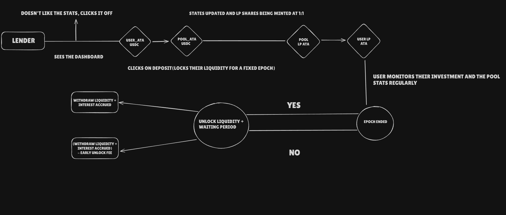
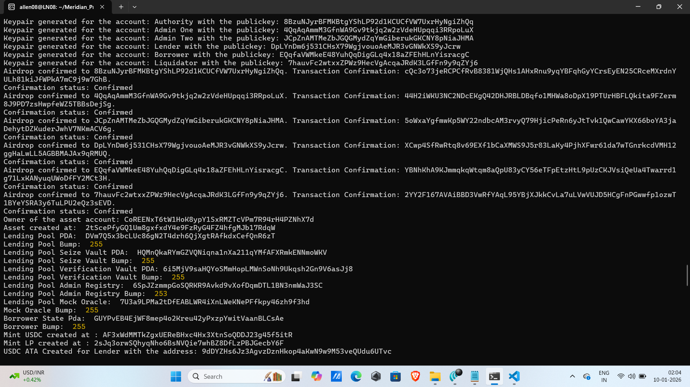
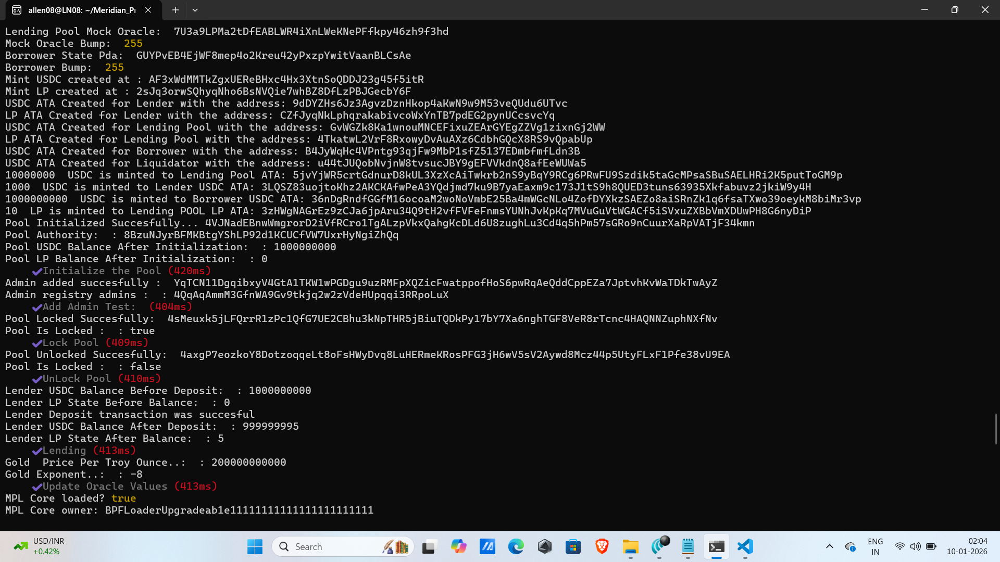
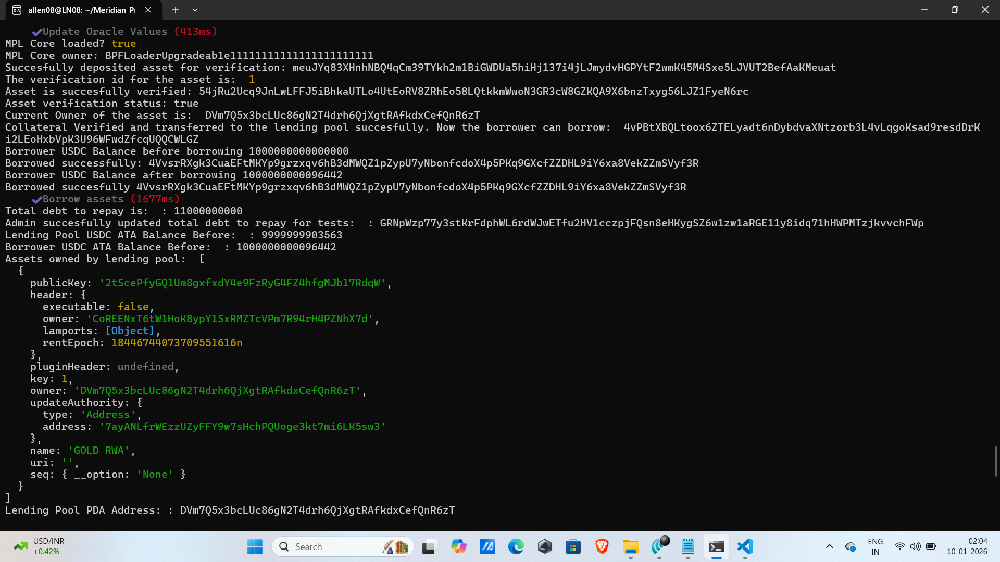
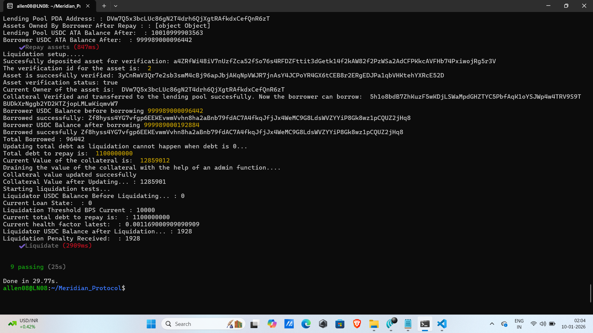

# Meridian Protocol(V1.0)

- Meridian is an on-chain lending market for real world assets aiming to provide stablecoin loans with rwa backed collateral on solana

- Meridian currently supports gold as an collateral, will be expanding to real-estate and minerals in future

- Users can earn interest on their stablecoin as lp providers while others can borrow stablecoin loans for their RWA's with a fixed interest rate decided at the time of borrowing based on the utilization rate at the time of borrowing.

# Instructions:

## 1. Lending: 

- An LP can lend USDC to the meridian markets backed by an CPMM(Constant Product Market Maker/Automated Market Maker) and earn interest on his liquidity. 

- While withdrawing liquidity he must go through a withdrawal period so as to make sure enough liquidity is available for everyone.

- LP can monitor his interests and the growing interests





## 2. Borrowing:

- 


## 3. Repay:


## 4. Liquidation


---

# Tests

- The program is thoroughly tested:






# Deployment

- Program Deployed Succesfully to Devnet


```
Program Id: 3hkm2XE7Zfwdv8sBK5oo4acQ6XdM4ypCm6ey68T4i9rN
Owner: BPFLoaderUpgradeab1e11111111111111111111111
ProgramData Address: ESj7si6M5WYCDJiEopdrjgU9VBaHH5Knj6673Lx6PLGd
Authority: 7ayANLfrWEzzUZyFFY9w7sHchPQUoge3kt7mi6LK5sw3
Last Deployed In Slot: 434052741
Data Length: 664136 (0xa2248) bytes
Balance: 4.62359064 SOL
```


---

## Local Testing

```
- Anchor version - anchor-cli 0.31.1
- Solana version - solana-cli 3.0.13 (src:90098d26; feat:3604001754, client:Agave)
- Configuration - Testnet
```